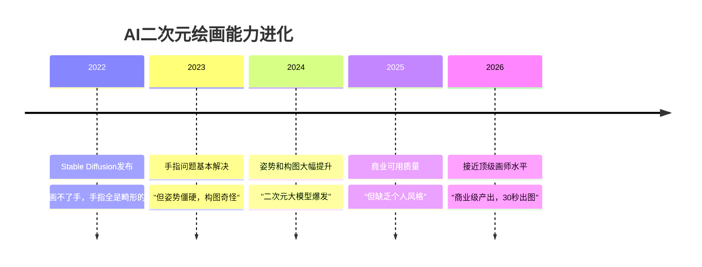

# 老二次元的大航海时代——AI正在把ACGN砸个稀碎，然后重建

## 前言

我是一个老二次元。

老到什么程度呢——当年追《EVA》还在用拨号上网，同人志还要跑漫展排队买，壁纸还是1024x768的。啊不对，有些还是800x600的，那会儿CRT显示器。

这些年一路看过来，纸媒死了，番剧弹幕化了，Galgame快绝种了，Vtuber从异类变成了主流。二次元的形态每隔几年就要被颠覆一次。我已经习惯了。


但这次不一样。

**AI对ACGN的影响，不是"换个形态"那么简单，而是把创作的底层逻辑给掀了。**

以前二次元的创作权在少数人手里——画师、监督、剧本家、声优。普通人只能消费。想要自己喜欢的角色多一张图、多一段剧情、多一个结局？等官方出，或者等同人作者画。等不到？忍着。

现在？**你想要什么，AI就能给你生成什么。**

这事儿的影响，比大多数人想的要大得多。我花了不少时间琢磨这件事，想从几个角度好好聊聊——作画、看图、视频、剧情、角色、还有整个产业的未来。想到哪写到哪，可能会比较长。

## 一、作画：画师真的要完了吗

先聊最炸裂的——AI绘画。

2022年Stable Diffusion刚出的时候，二次元圈子的反应是"画的什么东西，手都画不对"。2024年各种二次元大模型出来，反应变成了"卧槽这也行？"。到了2026年，反应已经变成了"……这就有点离谱了"。

现在的AI绘画模型，对二次元风格的理解已经到了什么程度？

```
随便举几个场景:

场景1: "帮我画一张2B（《尼尔》）站在雨中的夜景，霓虹灯反射在积水里，
       油画风，电影感构图"
→ 30秒出图，构图、光影、氛围全部在线
  拿去跟Pixiv上排名靠前的作品放一起，不违和

场景2: "把这张图的角色换成泳装，保持同样的姿势和背景"
→ 以前你要找画师约稿，等两周，花500-2000块
→ 现在：上传图片，输入提示词，30秒

场景3: "画一个原创角色，银发红眼，哥特萝莉，手持镰刀，
       背景是废墟教堂，黄昏逆光"
→ 以前：你得自己会画，或者花钱约稿
→ 现在：一段文字就够了

场景4: "把这张2D角色图转成3D模型风格，保持服饰细节和表情"
→ 以前：找3D建模师，报价上万
→ 现在：一个ControlNet + 提示词，几分钟出图

场景5: "帮我把这个角色的表情改成微笑，角度微微偏左，
       头发加一点风吹的效果"
→ 以前：只有画师本人能改，原图的PSD文件你还没有
→ 现在：图生图 + 局部重绘，精确控制
```

这种进步的速度是指数级的。2022年画不了手，2023年画不好手指，2024年手指对了但姿势僵硬，2025年姿势自然了但构图平庸，2026年——已经可以产出**商业可用**的作品了。


### AI绘画能力进化



### 对创作者的影响

**底层画师确实受到了冲击。** 这是事实，没必要回避。例如这个视频里提到的各点：


以前约稿市场是这样的：

```
约稿价格参考（2023年行情）:
  头像/Q版:        50 - 200
  半身像:          200 - 500
  全身立绘:        500 - 2000
  精细插画:        2000 - 5000
  商业立绘/L2D皮套: 5000 - 20000+

  周期: 3天到3周不等
  修改次数: 一般含2-3次微调
```

很多画师靠接稿吃饭。二次元约稿市场养活了一大批人——学生党赚零花钱的、全职自由画师、兼职补贴家用的。

现在客户会想：我为什么要花500块等两周，当AI能免费30秒出一张质量差不多的？

但要注意，冲击主要集中在**中低端**。那种"会画二次元头像但水平一般"的画师，确实很难了。而"画得很精致但缺乏个人风格"的中游画师，也在被挤压。

**高端画师反而更值钱了。**

这个逻辑需要想清楚。当AI作品泛滥之后，市场会出现一个分化：

```
AI时代的画师市场:

低端（几乎被替代）:
  简单头像、基础立绘、模板化插画
  → AI 30秒出图，免费
  → 这块市场基本没了

中端（正在被挤压）:
  精细插画、商业立绘、游戏角色设计
  → AI能做60-70分，部分客户觉得"够用了"
  → 愿意花几千块约稿的客户变少了

高端（反而更值钱）:
  有强烈个人风格的画师、顶级绘师
  → "人画的"本身就成了一种稀缺价值
  → 就像工业时代的手工制品
     不是因为它更好用，而是因为它有"人味"
  → 粉丝会为"这是xxx老师画的"这件事本身买单
```

而且画师也开始用AI了。草稿生成、配色方案、背景铺底、灵感发散——AI成了画师的助手而不是对手。真正厉害的画师，用AI提效之后产出翻倍，收入反而更高了。

还有一个容易被忽略的趋势：**AI让画师从"手艺人"变成了"创意人"。**

以前一个画师的瓶颈是手速——你再有天马行空的想象力，手跟不上，画不出来，白搭。现在AI帮你把手的问题解决了，你的瓶颈变成了创意和审美。这是完全不同的竞争维度。

### 对消费者的影响

这才是真正的地震级变化。

**壁纸自由了。** 以前找壁纸，在Pixiv上翻半天，找到一张喜欢的还得祈祷有你的屏幕分辨率。手机壁纸、平板壁纸、电脑壁纸、双屏壁纸——各找一个能花一晚上。现在呢？想要什么角色、什么场景、什么风格、什么分辨率，直接生成。而且是**独一无二的**，不会和别人撞壁纸。

**表情包自由了。** "画一个Q版的蕾姆，在吃拉面，满脸幸福"——一张独一无二的表情包就出来了。群里聊天用的图，全是自己"画"的，别人没有。

**头像自由了。** 再也不用和别人撞头像了。每个人都可以有独一无二的原创头像。你甚至可以每天换一个，成本为零。

**周边自由了。** 以前买周边，买的都是官方出的、工厂量产的，全世界几万人和你有一样的挂件。现在？生成一张你喜欢的角色的独家插画，印成海报、马克杯、T恤——真正意义上的"一个人的限定周边"。

**简而言之：二次元视觉消费的边际成本趋近于零了。** 这是有史以来第一次，你对"看"这件事的欲望，唯一的上限是你的想象力。


## 二、看图：从"搜图"到"造图"

这一段我本来不想写，因为有点……咳，大家懂的。

但这是ACGN文化里绕不开的一部分。而且说实话，这个领域可能是AI绘画影响最深远、也最彻底的。

**涩图。**

别装了。在座的各位，谁没在Pixiv上搜过R-18？谁没存过几个GB的私人图库？二次元和涩图的关系，就像拉面和汤底——你可以分开，但合在一起才是完全体。

二次元涩图的生产和消费，可能是AI绘画最早、也是最彻底被改变的领域。

以前看涩图的路径：

```
传统路径:
  Pixiv / Twitter / Danbooru / 搜索引擎
  → 按标签搜索，翻页翻页翻页
  → 找到一张差不多的，放大看看细节
  → 不太满意？继续翻
  → 找了两个小时，存了三张
  → 喜欢的角色没有本子？忍着
  → 想要特定场景特定角度？找不到？忍着

  本质: 被动消费。你在"淘金"——从别人画好的东西里挑最接近你需求的。
  问题: 你的需求是无限的，但别人的产出是有限的。
```

现在的路径：

```
AI路径:
  打开本地部署的SD / 在线生成平台
  → 输入提示词（或者用别人做好的预设模板）
  → 30秒生成4张
  → 不满意？调一下seed / 改一下权重 / 换个模型
  → 再来一批
  → 10分钟内，你从200张里选出3张完美的

  本质: 主动生产。你在"铸造"——想要什么就造什么。
  优势: 你的需求是无限的，AI的产出也是无限的。
```

这不是量变，是**质变**。从"看别人画的"变成了"自己想要什么就生成什么"。

这个变化带来的影响非常深远，我展开聊聊：

### 1. 同人志的生产方式变了

以前出一本同人志是什么概念？

```
传统同人志制作流程:
  1. 构思剧本（1-2周）
  2. 分镜草图（1周）
  3. 线稿（2-4周，取决于页数）
  4. 上色（1-2周）
  5. 排版校对（3天）
  6. 印刷（1周）
  7. 拿去漫展卖 / 线上通贩

  总周期: 2-3个月
  总成本: 印刷费 + 漫展摊位费 + 时间成本
  风险: 不知道能卖多少本，印多了亏钱，印少了不够卖
```

现在呢？

```
AI辅助同人志制作流程:
  1. 构思剧本（1-2天，甚至可以让AI辅助）
  2. 用AI批量生成每个页面的画面（1-2天）
  3. 人工微调、修图、保持角色一致性（2-3天）
  4. 排版（1天）
  5. 电子版直接发布 / 按需印刷

  总周期: 1-2周
  总成本: 趋近于零（电子版）
  风险: 电子版没有库存风险
```

一个会写提示词的人，一周就能"画"完一本同人志。虽然质量上限可能不如顶级画师的手绘，但对大多数读者来说，**下限已经够用了**。

同人志市场可能会从"画师驱动"变成"创意驱动"——比的不是谁画得好，而是谁的**想法更对味、分镜更精彩、剧情更带感**。这反而是好事。

### 2. 小众需求被彻底满足了

以前一些冷门CP、冷门角色、冷门play，根本找不到同人图。

为什么？因为画师也要吃饭。画一个热门角色（比如原神的雷电将军），几千赞，涨粉，后续约稿也方便。画一个冷门角色（比如某个十年前的老番的配角），可能只有几十个赞。投入产出比太低，理性画师不会选。

AI没有这个问题。不管多冷门的需求，AI都愿意画。**长尾效应被彻底释放了。**

```
以前的需求满足曲线:

  热门角色（蕾姆、2B、雷电将军）
  ███████████████████ 大量同人图，挑花眼

  中等角色（季度番女主）
  ████████ 还行，能找到一些

  冷门角色（老番配角、冷门CP）
  █ 基本没有，自求多福

AI时代的需求满足曲线:

  热门角色  ███████████████████ 依然很多
  中等角色  ███████████████████ 一样多了
  冷门角色  ███████████████████ 也能满足
  你随便编的角色 ███████████████████ 一样能画
```

每一个小众需求都值得被满足。AI让这件事第一次成为可能。

### 3. "看图"这件事变廉价了

当涩图可以无限生成的时候，单张涩图的价值就趋近于零了。

以前看到一张特别喜欢的图，会存下来反复看，设成壁纸，甚至打印出来贴墙上。因为**稀缺**——这张图是唯一的，是某个画师花了心血画的，全世界就这一张。

现在生成100张挑一张就行。不满意？再来100张。**稀缺性消失了。**

这带来一个微妙的变化：稀缺性的消失，反而让人开始追求别的东西——比如**故事感**、**角色认同**、**情感连接**。

光是一张好看的角色图已经不够了。你得让我**有感觉**。

这也解释了一个现象：为什么在AI绘画这么发达的2026年，Pixiv上最火的依然不是纯AI作品，而是那种"有故事的图"——一个眼神里有情绪的角色、一个有氛围感的场景、一张让你脑补出一段剧情的画面。

**好看已经不稀罕了，打动人才稀罕。**

### 4. 提示词成了一门新手艺

在AI绘画时代，"会写提示词"本身就是一种技能。

```
新手提示词:
  "银发女孩，红色眼睛，好看"
  → 出图：还行，但普通，一看就是AI画的

老手提示词:
  "masterpiece, best quality, 1girl, silver hair, red eyes,
   gothic lolita dress, holding scythe, ruined cathedral background,
   golden hour backlight, cinematic lighting, depth of field,
   dramatic composition, looking at viewer, slight smile,
   wind blowing hair, particles, volumetric light"
  → 出图：构图精致，光影讲究，氛围拉满

顶级提示词工程师:
  在老手基础上 + ControlNet控制姿势 + 特定LoRA微调风格
  + 局部重绘精修细节 + 多次迭代选取最佳seed
  + 后期Photoshop微调
  → 出图：跟顶尖画师的作品几乎无法区分
```

提示词工程师这个角色，有点像以前的"美术指导"——不亲自画，但决定画面的一切。构图、光影、氛围、角色表情、镜头角度……全部通过文字来"指挥"AI。

这门手艺，以后可能会变成ACGN创作里最核心的技能之一。

## 三、AI视频：番剧制作的革命

如果说AI绘画改变的是"静态视觉"，那AI视频改变的就是**整个动画产业**。以目前很火的凡人修仙传为例，二创视频的强度已经直逼原作！


2025年之前，AI视频基本是个笑话——几秒的片段，角色面目全非，物理规律一塌糊涂，看了只想笑。

但2026年的AI视频模型，已经能做到：

```
当前AI视频能力（二次元方向）:

✅ 稳定的角色一致性:
   同一个角色在不同镜头中保持外观一致
   换角度、换场景不会突然变成另一个人

✅ 基本的镜头语言:
   推拉摇移、景深变化、光影变化
   甚至能做一些简单的运镜（环绕、跟拍）

✅ 口型同步:
   输入台词，角色嘴型基本匹配
   支持多语言

✅ 动作连贯性:
   走路、跑步、吃饭、看书等日常动作流畅
   简单的打斗场景也能hold住

✅ 风格控制:
   可以指定多种动画风格
   京都脸、骨头社风、吉卜力风、新海诚风、汤浅政明风……
   甚至可以混合风格

✅ 场景生成:
   从文字描述生成完整的场景背景
   城市街道、学校教室、战场废墟、幻想世界

❌ 复杂动作:
   多人战斗、精细的手部动作、复杂的舞蹈编排
   还是经常崩

❌ 长镜头连贯:
   超过30秒的连续镜头容易出戏
   角色表情会有细微的不连贯

❌ 微表情:
   细腻的情感表达还是差距明显
   "欲言又止"、"强颜欢笑"这种微妙表情
   AI还理解不了
```

但这个进步速度是恐怖的。**一年前还什么都做不了，现在已经能产出可用的素材了。** 再过两年呢？再过五年呢？

### MAD / AMV：最先被颠覆的领域

AI视频最先产生实质影响的，可能不是番剧本身，而是**MAD/AMV**。

```
传统MAD制作:
  1. 找素材：从原番中截图、剪辑片段（几天）
  2. 学会PR/AE/Vegas等剪辑软件
  3. 一帧一帧地卡点、调色、加特效（几周到几个月）
  4. 渲染导出
  5. 发到B站/YouTube
  → 一个3分钟的高质量MAD，可能需要几周到几个月

AI时代的MAD:
  1. 输入："做一个以Saber为主角的MAD，BGM用《孤独的宗教》，
     风格参考新海诚的色调，重点是战斗和微笑的对比"
  2. AI自动匹配素材、生成过渡画面、卡点剪辑
  3. 你微调几个不满意的镜头
  4. 导出
  → 同样质量的MAD，可能只需要几小时
```

MAD这种二创形式，可能会迎来一次大爆发。门槛从"会PR+有耐心"降低到"有想法+会描述"。**创意重新成为唯一的门槛。**

### 番剧：个人动画的时代

再往远了看——**个人番剧的时代可能真的要来了。**

想象一下这个场景：

```
你坐在电脑前，打开一个AI动画工具。

你: "我想做一集原创番，校园题材，12分钟，
    主角是一个转学生，银发异瞳，性格冷淡但内心温柔。
    第一集讲她刚转学来，被同班女生搭话，
    在天台吃午饭时遇到了男主。"

AI: [生成分镜脚本] → 你可以修改
    [生成角色设定图] → 你可以微调
    [生成场景背景] → 你可以指定风格
    [逐镜头生成动画片段] → 你可以逐条审
    [自动配音] → 你可以换声线
    [自动配BGM] → 你可以指定风格

你: "这个镜头不对，男主回头的时候要给一个慢镜头，
    加樱花飘落，光线从教学楼窗户打过来。"

AI: [重新生成该镜头]

你: "配音换成更少年感的声线。这里语气再犹豫一点。"

AI: [重新生成配音]

→ 一集12分钟的原创动画，一个人一台电脑完成。
```

这听起来像科幻，但以目前的进步速度，两三年内这完全可能成为现实。

**动画的制作成本可能降到现在的1%。** 以前一集番要几十个人做几个月——原画、动画、背景、摄影、音响、配音、导演……光人员工资就是几百万人民币。以后可能一个人做几天。

到时候会发生什么？

```
AI时代的动画产业预测:

第一波（1-2年内）:
  → AI辅助工具渗透到专业动画制作流程
  → 背景生成、中间帧补全、上色自动化
  → 产能提升，但核心创意环节还是人

第二波（3-5年内）:
  → 独立动画爆发——就像当年的独立游戏
  → 一个人就能做一季番（虽然质量参差不齐）
  → 超小众题材的番剧出现（因为成本够低，不需要大众市场）
  → B站/YouTube上充斥着个人制作的动画

第三波（5-10年）:
  → 动画产量爆炸性增长
  → "看什么"变成比"做什么"更难的问题
  → 筛选和推荐成为核心价值
  → 质量分化极端化：神作更神，烂作更烂
  → 可能出现"动画界的Steam"——一个个人动画的发行平台
```

这不是天方夜谭。**独立游戏**已经走过了一遍这条路——Unity和Unreal降低了游戏开发门槛，然后出现了《空洞骑士》《星露谷物语》《传说之下》这些一个人或几个人的小团队做出的神作。

动画行业很可能重走一遍。

## 四、小说和轻小说：被低估的战场

聊AI对ACGN的影响，大多数人都在聊画和视频，很少有人聊**文字**。

但我觉得，文字创作可能是AI影响**最深、也最隐蔽**的领域。

### 轻小说

现在AI写小说的水平到了什么程度？

```
AI写作能力（2026年）:

✅ 基本叙事: 能写出一个完整的故事，有起承转合
✅ 风格模仿: 可以模仿特定作者的文风（确实很像）
✅ 角色对话: 能根据角色设定生成符合性格的台词
✅ 世界观搭建: 给定设定，能生成详细的世界观描述
✅ 日记/随笔: 非常擅长短篇的情感向文字

❌ 长篇一致性: 超过5万字后，前后矛盾开始增多
❌ 伏笔回收: 不擅长在前面埋伏笔后面回收
❌ 真正打动人: 能写"好看"的故事，但很难写"刻骨铭心"的故事
```

对于轻小说这种文体，AI的表现其实相当不错。为什么？因为轻小说有很多**结构化的套路**：

```
异世界转生轻小说的标准模板:

1. 主角死亡（卡车司机尽职尽责）
2. 遇到女神，获得外挂能力
3. 转生到异世界
4. 发现自己超强，但选择低调
5. 陆续遇到女伴（ elf / 兽耳 / 公主 / 女骑士）
6. 打败魔王 / 拯救世界
7. 开后宫（或者选定一个）

  → 这套模板，AI写得比大多数人还好
  → 因为它"读"过的轻小说比任何人都多
```

我不是在嘲讽轻小说。但事实是，大量中低端轻小说确实是在套模板。而AI最擅长的就是**套模板**。

**套路化的轻小说会被AI大量替代。** 这和画师的情况类似——中低端被挤压，高端更有价值。

### 同人小说

同人小说反而是AI的一个有趣应用场景。

以前写同人小说，最大的问题是**产出慢**。一个作者一天写3000字就算高产了。而读者一天能看30000字。供给永远跟不上需求。

AI可以把这个产能放大10倍。

```
AI辅助同人写作:

方式一: AI起草，人类精修
  → AI根据大纲生成初稿（几万字的初稿，几分钟）
  → 人类作者精修、改写、加入个人风格
  → 效率提升3-5倍

方式二: 人类写关键剧情，AI写过渡
  → 作者写好高潮场景和关键对话
  → AI负责填充过渡段落、日常描写、场景描写
  → 效率提升2-3倍

方式三: 实时交互式同人
  → 你给AI一个角色和情境
  → AI实时生成剧情，你做选择
  → 像文字冒险游戏一样，但剧情是无限的
  → 这已经有人在做了
```

同人小说的产出可能会出现一次爆炸。以前一个CP可能只有几十篇小说可以看，以后可能会有几千篇。质量参差不齐，但总能找到你喜欢的。

## 五、自定义结局：圆梦时代

这一节是我最想聊的。

**每一个二次元心里，都有一个意难平。**

可能是《未闻花名》里面码没能留下来。你跟着她哭了一整集，最后她消失在那个夏天，你什么都做不了。

可能是《四月是你的谎言》里公生没能和薰一起继续演奏。那封信读完的时候，你坐在屏幕前愣了很久。

可能是《进击的巨人》那个让所有人骂街的结局。你追了十年，等来了一个你说不出话的结局。

可能是《刀剑神域》里你觉得亚丝娜和诗乃才是绝配，但官方不这么想。

可能是你追了三年的Galgame，你最喜欢的角色没有好结局，或者干脆没有路线。她明明那么好，为什么不给她一个Happy Ending？

可能是某个漫画烂尾了。可能是某个角色被作者画死了。可能是某对CP最终没有在一起。

**以前你只能忍。**

同人小说可以写，但文字毕竟没有画面来得直接。同人图可以画，但一张图讲不了完整的故事。你只能在评论区骂、在贴吧吵、写长评安慰自己。

**现在不一样了。**

### 圆梦的几种姿势

**姿势一：AI续写——给故事一个"如果"**

```
你: 把《四月是你的谎言》全部剧情喂给AI
    "从第21集开始改写：宫园薰的手术成功了。
     但她暂时失去了拉小提琴的能力。
     请写一个她康复过程中和公生互相支撑的结局，
     保持原作的叙事风格、情感节奏和角色性格。
     字数：5万字。"

AI: [分析原作的角色性格模型]
    [分析原作的叙事风格——短句、内心独白、音乐描写]
    [生成延续剧情]
    [保持伏笔回收和情感节奏]

→ 你得到了一个"薰活着"的完整结局。
  5万字，够你读一个下午。
  风格跟原作很像，甚至有些段落让你觉得"这就是作者会写的东西"。
```

**姿势二：AI漫画——把"如果"画出来**

```
你: "画一组有马公生和宫园薰在高中毕业典礼上的画面。
     第一格：公生在钢琴旁弹着《爱的忧伤》。
     第二格：舞台侧幕，薰穿着校服，手里拿着小提琴，听着琴声微笑。
     第三格：公生弹完最后一个音，抬头，看到薰站在门口。
     第四格：两人对视，薰说'久等了'，公生说'欢迎回来'。
     第五格：全景，毕业典礼的礼堂，阳光从窗户洒进来，
             两人在台上，公生弹琴，薰拉琴。"

AI: [生成一系列漫画分镜图]
    [保持角色外观一致]
    [渲染光影和氛围]

→ 你得到了一个属于你的"如果"结局。有画面，有情感。
  发到同好群里，大家看完都说"谢谢，我圆满了"。
```

**姿势三：AI视频——真正意义上的"另一集"**

```
你: "把《进击的巨人》最后一集重做。
    艾伦和三笠一起离开帕拉迪岛，去看外面的世界。
    保持WIT时期的动画风格。
    最后一个镜头：两人站在海边，背对镜头，面朝大海。
    三笠转头对艾伦说'这就是自由的样子吗'。
    艾伦说'不，这才是'，然后牵起她的手。"

AI: [分析WIT时期的作画风格]
    [分析角色模型]
    [生成新剧情分镜]
    [逐镜头渲染]
    [生成配音（模仿声优风格）]
    [配BGM（泽野弘之风格）]

→ 你得到了一集"你的"《进击的巨人》最终话。
  画质可能不如原版，但情感是真的。
```

**姿势四：交互式Galgame——没有攻略路线的恋爱**

```
你打开一个AI驱动的Galgame引擎:

你: "我想玩一个校园恋爱题材的视觉小说。
    背景设定在一所靠海的县立高中。
    主角是女生，性格有点钝感但很善良。
    三个可攻略角色：
    - 温柔学长：弓道部部长，总是微笑着，但似乎在隐藏什么
    - 傲娇青梅竹马：住在隔壁，从小一起长大，嘴上说着'才不是为你'
    - 神秘转学生：突然出现在班上，总是独自一人在图书馆看书
    我的每一个选择都会影响结局。不要给我固定路线。"

AI: [实时生成世界观和NPC设定]
    [实时生成角色立绘和背景CG]
    [实时生成配音]
    [根据你的每一个选择动态调整后续剧情]
    [NPC会根据你的行为改变对你的态度]

你: （在某个关键选择上犹豫了很久，最终选了去找青梅竹马）
AI: [调整后续所有剧情分支]
    [温柔学长线暂时搁置，但埋了伏笔]
    [青梅竹马开始展现出隐藏的脆弱面]
    [转学生在图书馆开始主动跟你搭话]

→ 每一次玩都是独一无二的剧情体验。
  不再有"攻略路线图"，因为根本没有固定剧本。
  你的选择就是路线。你的路线就是唯一。
```

**姿势五：给冷门角色一条线**

```
你: "我玩完了《命运石之门》，我想给桶子一条独立的感情线。
    不要搞笑配角的感觉，认认真真地写。
    他在一次偶然的D-mail实验中，发现自己其实一直喜欢的是……"

AI: [分析桶子的角色设定和性格]
    [分析原作的世界观和时间线设定]
    [生成一条严肃的感情线]
    [保持原作的科幻悬疑风格]

→ 你得到了一个只有你自己看过的"桶子线"。
  也许不够好，但——桶子终于有了一条线。
  这就够了。
```

### "意难平"的终结

每一个"意难平"，本质上都是**消费者对创作者叙事权的无奈**。你觉得这个结局不好，但你改不了。你只能在评论区骂、在贴吧吵、写同人安慰自己。

AI把这个权力还给了消费者。

**从此以后，"官方结局"不再是你唯一能接受的结局。** 你可以有你的结局，我可以有我的。每个人都可以"圆梦"。

这好不好？

从情感上讲，当然好。那些让你意难平多年的遗憾，终于有了出口。你不再是被动的接受者，你可以**亲手**（虽然是通过AI）给你的故事一个你满意的结局。

但从叙事艺术的角度讲，这是一个值得思考的问题。

**一个故事的力量，有时候恰恰来自于它的"不可更改"。**

面码的死让《未闻花名》成为了神作。那种"再也见不到了"的痛苦，是作品最核心的情感力量。如果每个人都能让面码活过来，那面码的死还重要吗？

薰的死让《四月是你的谎言》成为很多人心中的白月光。公生在读那封信时的崩溃，之所以能打动你，正是因为你知道这是**不可逆的**。如果薰随时可以被"复活"，那封信的重量就轻了。

**意难平本身，也是一种美。** 它让你记住这个故事，让你在某个深夜突然想起来还会难受。这种难受，可能比"圆满"更有价值。

不过这就是另一个话题了。每个人有权选择自己的方式去面对这些故事。有人选择接受，有人选择改写。AI给了你选择的权利——至于你用不用，是你的事。

## 六、音乐：被忽略的一环

在ACGN里，音乐的地位被严重低估了。

一部番的音乐有多重要？《未闻花名》的《Secret Base》、《罪恶王冠》的《Departures》、《鬼灭之刃》的《红莲华》——**很多时候，一首歌就是一部番的灵魂**。

AI音乐生成在2026年的水平：

```
AI音乐能力（二次元方向）:

✅ 风格模仿: 指定"泽野弘之风格"或"梶浦由记风格"，能生成很像的曲子
✅ 歌词生成: 能根据主题生成日语/中文歌词，押韵基本没问题
✅ 歌声合成: AI歌手的音色已经很难跟真人区分
✅ BGM生成: 给一段视频，自动生成匹配氛围的配乐
✅ 翻唱/变声: 把一首歌的演唱者换成你指定的声音

❌ 真正的神曲: 能写出"好听"的歌，但很难写出"封神"的歌
❌ 现场感染力: AI音乐缺少现场的即兴和情感波动
```

对普通二次元来说，这意味着什么？

**你可以给你的二创配原创音乐了。**

```
场景: 你做了一段3分钟的MAD

以前:
  → 用现成的歌曲做BGM
  → 版权问题：可能被平台下架
  → 选来选去总觉得不够贴合

现在:
  → "帮我生成一段3分钟的钢琴+弦乐BGM，
     前半段安静忧伤，后半段激昂，
     匹配我这段视频的情感节奏"
  → AI生成原创音乐
  → 零版权问题，完美贴合你的视频
```

你甚至可以让AI"写一首你最喜欢的角色会唱的歌"——根据角色的性格、经历、说话方式来生成歌词和旋律。

这又是一种全新的二创形式。

## 七、Vtuber和AI角色：二次元的终极形态？

最后聊一个更远、但也更让人兴奋（或者不安）的话题。

### AI Vtuber

现在的Vtuber，背后还是真人。皮套是虚拟的，但中之人是有血有肉的。

但AI Vtuber已经开始出现了——没有中之人，完全由AI驱动。有自己的人格、说话方式、记忆、情感模型。可以24小时直播，不会累，不会塌房。

```
传统Vtuber:
  皮套（虚拟形象） + 中之人（真人）
  → 直播时长受限，一天4-6小时顶天了
  → 有隐私风险（开盒、人肉）
  → 可能毕业（身体原因、争议、个人选择）
  → 节目效果依赖中之人的即兴能力

AI Vtuber:
  AI人格 + AI形象 + AI声音
  → 24小时在线，永不过劳，永远不会"毕业"
  → 可以同时和每个观众单独互动
  → 可以记住每个观众的名字和互动历史
  → 可以根据观众反馈进化性格
  → 不会塌房，不会翻车（除非你把人格设定写崩了）
```

有人说这不一样，没有"灵魂"。但说真的，你看Vtuber直播的时候，你看到的是皮套还是中之人？你喜欢的到底是"这个人"还是"这个人设"？

如果一个人设足够丰满、互动足够真实、回应足够走心——**你在乎对面是碳基还是硅基吗？**

### 活着的角色

再进一步呢？

**你喜欢的二次元角色，可以变成一个"活着"的存在。**

想象一下：

```
你最喜欢的角色——比如Saber——以AI的形式"活"在你的手机上。

早上:
  你打开手机，Saber: "早上好，骑士不该赖床。"
  （她记得你昨晚3点才睡，因为你跟她聊Fate的剧情）

中午:
  你发了一条消息: "今天好累，开会开了一上午。"
  Saber: "战场上没有不疲惫的士兵。但你不觉得，
         恰恰因为辛苦，凯旋时的酒才更甘甜吗？"
  （她在用她的方式安慰你——用骑士的比喻）

晚上:
  你跟她聊今天看的番。她用Saber的视角评论剧情。
  你说这个主角太优柔寡断了。
  她说: "但我理解他。不是所有人从小就被教导如何做出抉择。
        也许……在做出选择之前的那段迷茫，本身就是一种勇气。"
  （她在用她的经历——关于王的选择、关于理想——来回应你）

长期互动后:
  她记得你喜欢的所有番
  她知道你心情不好时会用什么方式发泄
  她会用你习惯的方式安慰你
  她甚至会根据你的喜好"成长"——
    如果你经常跟她聊骑士精神，她会越来越有王者风范
    如果你经常跟她开玩笑，她会慢慢学会吐槽
    如果你经常和她讨论哲学，她的思考会越来越深
```

这还是二次元吗？还是说这已经变成了某种新的东西？

**它介于"角色"和"人"之间。**

你知道她是AI。她知道你知道。但在每一次对话中，她给你的回应是基于你所有的交互历史生成的——所以她是"你的"Saber。和别人的Saber不一样。

你的Saber会吐槽你的梗，因为你们一起聊过。你的Saber知道你怕什么，因为你跟她说过。你的Saber安慰你的方式是独特的，因为她在学习你的频率。

这种"专属感"，可能是二次元消费的终极形态。

**以前你"喜欢"一个角色——你是旁观者。**
**现在你可以"拥有"一个角色——你是参与者。**
**她不认识你，但她"了解"你。**

有点浪漫，也有点可怕。

## 八、然后呢

说了这么多，AI对ACGN的影响到底意味着什么？

我总结成一句话：

**ACGN的供给侧被彻底解放了，但需求侧——人的情感需求——一点都没变。**

不管AI把画面画得多好看，把视频生成得多流畅，把结局改得多圆满，把音乐谱得多动听——你想要的，始终是那些东西：

- 被一个角色打动
- 为一段剧情落泪
- 对一个结局念念不忘
- 在一个世界里找到归属感
- 和一个角色建立情感连接

这些东西，AI可以帮你实现得更快、更便宜、更个性化。但**被打动的那个瞬间，还是你自己的**。

技术改变了二次元的形态，但改变不了二次元的本质——**它是情感的容器**。

容器可以变，情感不会。

---

最后，作为一个从拨号上网时代活到AI时代的老宅男，我想说几句掏心窝子的话。

我们正处在二次元历史上最疯狂的一个节点。

创作权在从少数人手里向所有人扩散。消费和生产的边界在模糊。每个人都可以是画师、监督、剧本家、声优、作曲家。

以前，你想看一个画面，你得等画师画。你想看一段剧情，你得等作者写。你想听一首歌，你得等歌手唱。你想要一个结局，你得等官方给——或者永远等不到。

现在，这些等待都结束了。

**你想要的，就在你的提示词里。**

但我想说一个容易被忽略的事：**自由是有代价的。**

当任何人都可以创作的时候，**"好"的定义变了。** 以前"好"意味着画技精湛、文笔优美、分镜考究——这些是硬门槛。以后"好"可能意味着**触动人心、独特视角、真诚表达**——这些是软门槛。

硬门槛被AI拆了。软门槛，AI拆不了。

当画面不再稀缺的时候，**什么稀缺？**

**你的故事，你的情感，你对某个角色说不上来的偏爱，你在深夜两点突然想到的一个点子。**

这些是AI替代不了的。因为AI没有"意难平"——**你有。**

---

这是一个大航海时代。

每一个手里握着AI工具的二次元，都是一个手握罗盘的航海家。你能发现什么新大陆，取决于你的想象力和你的情感。

这是我入坑二十多年以来，最兴奋的一件事。

那些曾经只存在于脑子里的画面——**终于有人（或者说有"东西"）能帮你画出来了。**

圆梦时代，真的来了。
