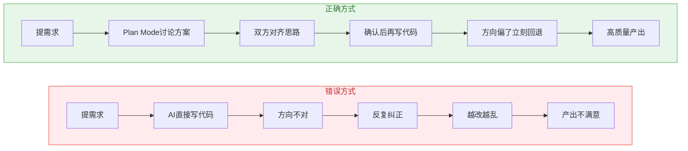

# 用了一年的AI编程工具，我发现自己一直在用错

## 写在前面

用Copilot、Cursor、Claude Code这些AI编程工具满一年了。说实话，刚开始那股兴奋劲儿过去之后，我进入了一个漫长的瓶颈期——觉得AI也就那样，能帮忙写写模板代码，复杂一点的就各种翻车。

直到前段时间，Claude Code的创始工程师Cat Wu和Boris Cherny在Every播客上做了一期访谈，详细聊了他们团队内部是怎么用自己造的工具的。这个团队有个天然优势：他们每天能观察到Anthropic内部几百个顶尖工程师怎么用Claude Code，相当于开了全图视野。

听完之后我整个人都不好了——**我发现自己过去一年的用法，基本全是错的。**

不是说我不会写提示词，而是我对"怎么跟AI协作"这件事的整个思维模型就有问题。以下是我总结的5条最反常识的教训，每一条都花了我真金白银的token费才想明白。

---

## 反常识一：别急着写代码，先聊聊计划

### 大多数人的做法

打开Claude Code（或者任何AI编程工具），上来就是一句：

> "帮我实现一个用户权限管理模块，要有角色、权限、菜单三级控制。"

然后AI就开始吭哧吭哧写代码，写到一半你发现方向不对，再纠正，AI改了一版还是不对，再纠正……就这么来回拉锯，最后产出一坨你不太满意但懒得再改的代码。

### 更好的做法

**用Plan Mode。**

Claude Code的Boris Cherny原话是这么说的："你可以把复杂任务的成功率提高两到三倍，方法就是在写任何代码之前，先切到Plan Mode，让Claude把要做的事情一步步列出来，双方对齐方案后再动手。"

这不是什么高深的道理，但执行起来极其反直觉。因为AI编程工具给你的第一印象就是"快"——你一句话，它哗哗给你生成几十行代码。这种即时反馈会让你产生一种错觉：**所有需求都应该one-shot搞定。**

但现实是，大多数时候AI搞砸了，不是因为它写不出代码，而是因为它根本没理解你想要什么。就像你让一个外包团队"做一个类似微信的东西"，他们能给你交个demo，但那肯定不是你要的微信。

### 实操建议

1. **Plan Mode先行**：复杂需求一律先进Plan Mode讨论，把技术方案、涉及的文件、可能的坑都过一遍
2. **AI审AI**：写完计划后，开一个新的Claude会话，让它以"资深工程师"的身份审查这个方案。这招效果出奇的好，因为AI审查AI不会有人际关系的包袱，该挑的毛病一个不留
3. **出问题立刻回退**：如果在执行过程中发现方向偏了，别继续硬推，立刻回到Plan Mode重新讨论。**在错误的方向上加速是最昂贵的浪费**



---

## 反常识二：让AI自己修Bug，别当微操大师

### 大多数人的做法

看到Bug -> 分析原因 -> 把自己的分析喂给AI -> 告诉它怎么改 -> AI改了还是有问题 -> 再告诉它换一种改法 -> 来回好几轮……

你本质上在做的事情是：**把自己当成项目经理，把AI当成初级程序员，事无巨细地指导它改每一行代码。**

### 更好的做法

**把错误信息甩给它，说一句"修了"。**

这不是偷懒，这是信任。Claude Code团队的人就是这么干的：

- Slack上收到一个Bug报告？复制粘贴进去，加一句"fix it"
- CI流水线测试挂了？"go fix the failing CI tests"
- Docker容器启动失败？把docker logs贴过去，让Claude自己看

关键不是你什么都不说，而是你提供**足够的信息**，然后让AI自己去闭环：

- **如何复现**：出现了什么操作之后才出现的问题
- **预期行为**：你期望的正确结果是什么
- **实际行为**：实际发生了什么
- **错误日志**：完整的报错信息

把这四样东西给到，然后你就不用管了。Claude会自己去读代码、找原因、改代码、跑测试、验证结果。很多时候你泡杯咖啡回来，Bug已经修好了。

这也是Claude Code团队能同时处理多任务的秘密——大部分Bug Claude能自己搞定，人只需要处理那些真正需要决策的问题。

### 一句话总结

> 与其教AI怎么修Bug，不如告诉它Bug是什么，然后相信它能修好。

---

## 反常识三：搞砸了就全删重来，别在烂摊子上缝缝补补

### 大多数人的做法

AI生成了一段代码 -> 不对 -> 告诉它改这里 -> 改了还是不对 -> 再改那里 -> 慢慢地，代码变成了一个怪物 -> 你已经不知道改了什么、为什么改了

这个过程特别像什么呢？**像你在一幅已经画歪了的画上反复修改，最后整幅画都脏了。**

### 更好的做法

**Git回滚，开新会话，带着学到的东西重新来。**

Claude Code官方文档写得非常明确：

> "如果你在同一个问题上纠正了Claude两次以上，上下文已经被失败方案污染了。这时候应该执行 /clear，写一个更好的初始提示词，从头开始。一个干净的会话+更好的提示词，几乎总是优于一个充满纠正记录的长会话。"

这背后的道理很硬核：**大语言模型的上下文窗口是有限的，而且性能会随着上下文填充而下降。** 当你在同一个会话里反复纠正AI时，之前那些错误的尝试、失败的方案、纠结的讨论，全部都还留在上下文里。就像你跟一个人吵架，虽然最后和解了，但那些说过的话都还记着，会影响后面的对话氛围。

所以正确的做法是：

1. `git checkout .` 或者 `git stash`，把代码回滚到干净状态
2. `/clear` 清空会话，或者直接开一个全新的Claude会话
3. 在新的提示词里写上：**"综合你目前了解到的一切信息，抛弃之前的方案，用更优雅的方式重新实现"**
4. 把你在上一次尝试中学到的经验——哪里容易出错、什么方案行不通——浓缩成两三句话放进新提示词里

**重新开局永远比缝缝补补便宜。** 这条原则不仅适用于AI编程，也适用于人生（笑）。

---

## 反常识四：让AI来质问你，而不是一直你问AI

### 大多数人的做法

你永远是那个提需求的人：

> "帮我实现XXX"
> "这段代码为什么报错"
> "给我写个单元测试"

你跟AI的关系永远是**你指挥、它执行**。

### 更好的做法

**翻转角色——让Claude来面试你。**

Claude Code官方文档里有一个特别推荐的使用模式叫"Let Claude interview you"：

```
我想实现 [简要描述]。请用AskUserQuestion工具详细面试我。

问我关于技术实现、UI/UX、边界情况、潜在风险和权衡的问题。
不要问那些显而易见的问题，挖那些我可能没考虑到的难点。

持续面试直到覆盖所有方面，然后写一份完整的规格文档到SPEC.md。
```

这招的妙处在于：**你让Claude从一个"执行者"变成了一个"审查者"。**

还有一个更狠的用法：

> "审查这些改动，在我通过你的测试之前，不准提PR。"

或者：

> "向我证明这个方案能work，列出所有可能的失败场景。"

本质上，你是在用AI来弥补自己思维的盲区。人总是倾向于想到最顺利的情况，而AI（特别是被告知要当"魔鬼代言人"的时候）会系统地帮你找出各种边缘情况、竞态条件、安全隐患。

### 这不是偷懒，这是杠杆

很多人觉得让AI来问自己问题，是不是本末倒置了？不是。你想，平时做Code Review的时候，最怕的是什么？是没有人challenge你的设计决策。现在你有一个永远有耐心、永远不会觉得"这问题太蠢不好意思问"的审查员，为什么不用呢？

---

## 反常识五：Sub-agent很酷，但简单架构才是王道

### 什么是Sub-agent

在Claude Code里，你可以让主Claude会话派生出多个子代理（sub-agent），让它们并行处理不同的子任务。听起来很美好对吧？就像你有了一个开发小团队。

Boris Cherny确实分享了一个很酷的用法：他做Code Review的时候，先派5个子代理分别检查不同方面（代码风格、项目历史、明显Bug），然后再派5个子代理专门来挑战前5个的结论，层层过滤之后，"结果非常棒，能找出所有真正的问题而不误报"。

### 但是，现实很骨感

**Sub-agent的稳定性目前还不够好，崩溃是家常便饭。**

而且Claude Code自己的设计哲学其实很保守：子代理**只负责调查和回答问题，不直接写代码**。为什么？因为子代理没有主代理的完整上下文，让它直接改代码容易出事。

所以Sub-agent真正的价值不在于"让AI写更多代码"，而在于：

- **保持主会话的上下文干净**：让子代理去读大量文件、做调研，然后把结论汇报回来，这样主会话的上下文窗口不会被一堆无关信息塞满
- **处理独立的小任务**：比如"用子代理查一下我们的认证系统是怎么处理token刷新的"，它会自己探索代码库，给你一个总结

### 血泪教训

> **简单的单线程架构 > 复杂的多agent编排。**

与其搞5个子代理互相打架（听起来酷，但调试起来要命），不如踏踏实实地：Plan -> Execute -> Verify。把一件事做好，比同时开5条线然后5条线都出问题要好得多。

如果你真的需要并行工作，有一个更简单粗暴的方案——看下一条。

---

## 彩蛋：并行工作树——一个进阶但实用的大招

如果你已经玩得比较熟了，可以试试**git worktree**。

原理很简单：用 `git worktree` 把同一个仓库checkout到多个目录，每个目录跑一个独立的Claude Code会话：

- **目录A**：在重构认证模块
- **目录B**：在写单元测试
- **目录C**：在更新API文档

三个Claude同时干活，你的工作流从"一件事一件事来"变成了"多件事并行推进"。

或者更简单粗暴一点：直接把仓库clone好几份，`project-1`、`project-2`、`project-3`，每个目录开一个Claude会话。笨是笨了点，但同样管用。

**不过有个提醒：** 并行工作的上下文切换成本很高。你得时刻记得哪个Claude在干什么、改了哪些文件、有没有冲突。这需要练习，新手很容易把自己搞晕。

我的建议是：**先在单会话里把基本功练扎实了，再考虑并行。** 就像学开车，先在驾校把倒车入库练好，别一上来就想漂移。

---

## 最后：关于"元教训"

说了这么多，我觉得最重要的一条教训不在上面任何一条里，而是：

> **AI编程的核心不是写更好的提示词，而是改变你对整个开发流程的思维方式。**

以前我们写代码的流程是：想清楚 -> 写代码 -> 调试 -> 测试 -> 部署。

现在应该是：**讨论清楚 -> 让AI写 -> 让AI自己验证 -> 让AI审查 -> 你做最终决策。**

你从一个"代码实现者"变成了一个"技术决策者和质量把关者"。这不是降级，这是升维。但前提是你要学会：

- **多计划，少微操** —— Plan Mode是你的好朋友
- **多信任，多验证** —— 给AI足够的信息和自主权，但要设好验证机制
- **出错就重来，别在错误上堆砌** —— 干净的上下文比什么都重要
- **让AI挑战你** —— 最好的协作不是单向指挥，而是双向质疑

这些道理说起来简单，但真正在日常工作中执行起来，需要不断地对抗自己的本能。毕竟，看到AI写错了代码，第一反应永远是"让我教你怎么改"，而不是"让我把上下文清了你重来"。

能对抗这种本能的人，才是真正会用AI编程的人。

---

*参考资料：*
- *[Claude Code官方最佳实践文档](https://code.claude.com/docs/en/best-practices)*
- *[How to Use Claude Code Like the People Who Built It - Every Podcast](https://every.to/podcast/how-to-use-claude-code-like-the-people-who-built-it)*
