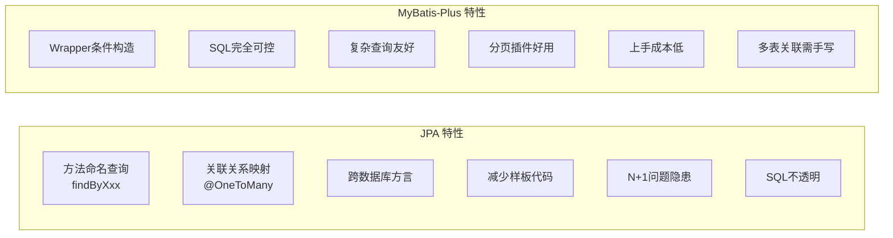

# JPA与MyBatis-Plus：别吵了，选自己顺手的就完事

前两天午休的时候，办公室里又炸了。

隔壁工位的老张拍着桌子："JPA才是正道！你看那个方法命名，`findByUserNameAndAgeGreaterThan`，一眼就知道干嘛的，根本不用写SQL，优雅！"

对面的老王头也不抬："优雅个锤子，你昨天那个多表联查的N+1问题查了一下午，最后还不是乖乖写了`@Query`。再说了，线上出了问题，你连生成的SQL长什么样都得靠日志猜，debug到怀疑人生。"

我坐在中间，端着杯咖啡看戏 (●ˇ∀ˇ●)

说实在的，这种争论从入行听到现在，就像"甜豆腐脑还是咸豆腐脑"一样，永远不会有一个统一的答案。但是说归说，作为一个被产品蹂躏、被测试折服的卑微后台开发，我对这两个框架倒是都踩过坑，也有一些自己的理解。

所以今天就从一个实用主义者的角度，聊聊这俩货各自的好与不好，以及——为什么我最后选择了MyBatis-Plus。

## 先简单认识一下两位选手

### JPA —— Hibernate的亲儿子

JPA（Java Persistence API）是Java EE的一套标准规范，而最主流的实现就是Hibernate。

它的核心理念是**面向对象操作数据库**。你不需要关心SQL怎么写，只需要定义好实体类和表的关系，通过操作对象就能完成数据的增删改查。

```java
@Entity
@Table(name = "t_user")
public class User {
    @Id
    @GeneratedValue(strategy = GenerationType.IDENTITY)
    private Long id;
    private String userName;
    private Integer age;
}
```

然后：

```java
public interface UserRepository extends JpaRepository<User, Long> {
    // 方法命名即查询
    List<User> findByUserNameAndAgeGreaterThan(String userName, Integer age);
}
```

完事。不用写一行SQL，不用写一行实现代码，Spring Data JPA在启动的时候自动帮你生成。

### MyBatis-Plus —— MyBatis的加强版

MyBatis-Plus（简称MP）是在MyBatis基础上只做增强不做改变的框架。

它的核心理念是**SQL可控，增强效率**。你依然可以写SQL，但大多数场景下用它的封装方法就够了。

```java
@TableName("t_user")
public class User {
    @TableId(type = IdType.AUTO)
    private Long id;
    private String userName;
    private Integer age;
}
```

然后：

```java
public interface UserMapper extends BaseMapper<User> {
    // 通用CRUD已经内置，想自定义再写SQL
}
```

调用时：

```java
List<User> users = userMapper.selectList(
    new LambdaQueryWrapper<User>()
        .eq(User::getUserName, "乐云一")
        .gt(User::getAge, 18)
);
```

同样是查询，逻辑清晰，而且你很清楚它背后执行的是什么SQL。

## 各有各的好

### JPA 让人爱的地方

**1. 方法命名查询，是真的优雅**

`findByUserNameAndAgeGreaterThanOrderByIdDesc`，这种命名规则只要习惯了，简单查询写起来是真的快，而且一眼就能看懂意图。

**2. 关联关系映射**

一对多、多对多、一对一，`@OneToMany`、`@ManyToMany` 这些注解配好之后，操作对象就等于操作数据库，从面向对象的角度来说确实很自然。

**3. 跨数据库能力**

因为JPA屏蔽了底层SQL，理论上换个数据库只需要换方言配置。当然实际上...也没那么简单就是了。

**4. 减少样板代码**

不需要手写CRUD的SQL，Repository接口继承一下就全有了。

### JPA 让人头疼的地方

**1. N+1 问题**

这是JPA最臭名昭著的问题之一。当你查询一个列表，然后访问列表中每个对象的关联属性时，JPA会为每个对象单独发一条SQL查询关联数据。

100条数据？101条SQL等着你。生产环境里遇到这个问题，数据库直接被你打爆。

当然可以用`@EntityGraph`、`@Fetch(FetchMode.JOIN)`来解决，但当你配置了半天发现还是不对的时候...嗯，你懂的。

**2. 复杂查询的灾难**

单表查询JPA很爽，但一到多表关联、子查询、分组统计这些复杂场景，`@Query`里的JPQL或者原生SQL写起来比MyBatis还痛苦。

而且JPQL和原生SQL的语法还有差异，踩坑的地方不比写MyBatis少。

**3. SQL不透明**

"这个方法到底执行了什么SQL？"——JPA的方法命名虽然语义清晰，但生成的SQL你说了不算。

出了性能问题，你得开着SQL日志慢慢猜。改了个方法名，SQL变了，查询效率也变了，但你可能完全不知道。

**4. 学习曲线**

JPA的背后是Hibernate，而Hibernate的水深得很。一级缓存、二级缓存、脏检查机制、flush时机、实体生命周期...想要用好JPA，这些概念不搞清楚，迟早踩坑。

### MyBatis-Plus 让人爱的地方

**1. SQL完全可控**

你写的每一条SQL、每一个查询条件，都是你自己在掌控。出了问题，打开日志一看就知道哪条SQL不对劲。

`selectList`、`selectPage`、`lambdaQuery`，你清楚地知道MP帮你做了什么，也清楚地知道你没有让它做什么。

**2. 复杂查询不费劲**

```java
// 多条件动态查询，清晰明了
LambdaQueryWrapper<User> wrapper = new LambdaQueryWrapper<>();
wrapper.eq(StringUtils.isNotBlank(name), User::getUserName, name)
       .gt(age != null, User::getAge, age)
       .orderByDesc(User::getCreateTime);
```

条件拼接比JPA的`Specification`优雅太多了。而且想写原生SQL？直接在Mapper里写就行，没有任何心理负担。

**3. 分页插件真好用**

MP的分页插件一行配置搞定，用起来也简单：

```java
Page<User> page = new Page<>(1, 10);
userMapper.selectPage(page, wrapper);
```

不比JPA那个`Pageable`简单？至少我觉得是。

**4. 上手快**

如果你有MyBatis基础，MP几乎零学习成本。就算没有，看个半天也能上手。没有什么缓存机制、实体生命周期这些概念要去啃。

### MyBatis-Plus 也会让人不爽的地方

**1. 字段映射比较死**

每个实体类都要加`@TableName`、`@TableId`、`@TableField`这些注解。表字段和Java字段之间的映射虽然支持驼峰转换，但遇到特殊情况还是得手动标注。

**2. 多表关联得自己来**

MP没有JPA那种优雅的关联映射，多表查询要么写SQL，要么在业务层自己做关联。说白了就是MP不管你，你自己决定怎么做。

**3. Service层的封装有时候过度**

MP的`ServiceImpl`封装了很多方法，`saveBatch`、`updateBatchById`、`lambdaQuery`...方法很多，有时候找一个特定场景的方法比直接写SQL还慢。

## 真正的问题不在于框架

聊到这里，其实我特别想说的是：**觉得某个框架垃圾的人，大部分是因为没有正确运用它。**

JPA不好吗？在简单的CRUD场景、领域驱动设计的项目里，JPA非常舒服。

MyBatis-Plus不好吗？在需要精细控制SQL、复杂报表查询、高并发场景下，MP的透明性和可控性是巨大的优势。

网上那些"JPA垃圾"、"MyBatis-Plus是屎"的言论，说到底就是：
- 用JPA的人不懂Hibernate，结果N+1、缓存问题一大堆，然后怪框架
- 用MP的人只会`selectList`，不会用`LambdaQueryWrapper`，不会封装BaseDao，SQL满天飞，然后怪框架

就比如我在 dao层这一块，基于 MyBatis-Plus 封装了一套自己的 BaseRepository 架构。`BaseRepository<M extends BaseMapper<DO>, DO>`，通过反射自动识别实体类类型，内置逻辑删除处理，支持对象转换、条件构造、分页查询。Service 层继承一下，基本的增删改查不用写一行重复代码。




具体怎么玩，我在[另一篇文章](mybatis-plus.md)里详细说了我的理解和封装思路。感兴趣的可以翻翻。

所以你看，框架本身没有错，错的是我们用不好它。就像菜刀，在厨师手里能切出文思豆腐，在我手里只能切到手。

## 为什么我选了MyBatis-Plus

说了这么多"各有各的好"，但作为一个卑微的后台开发，最终还是要做一个选择的。

我选MyBatis-Plus的原因很简单：

**1. 我要掌控SQL**

在线上排查问题的时候，我需要清楚地知道每一条SQL的执行计划、耗时、扫描行数。MP让我能精确控制每一个查询条件，出了问题我能迅速定位。

**2. 复杂业务场景多**

日常开发中，多表关联查询、动态条件拼接、批量操作太多了。MP的`Wrapper`系列用起来就是顺手。

**3. 封装自由度高**

我能在MP的基础上封装出适合自己团队的DAO层架构，既保留了MP的通用能力，又能约束团队的编码规范。这种自由度JPA给不了我。

**4. 团队上手成本低**

新人来了，学MP比学JPA快得多。不用啃Hibernate的源码，不用理解实体生命周期，会用Wrapper就能干活。

说白了就是——**顺手，可控，真的香。**

## 最后

写这篇文章不是为了引战，也不是为了证明谁更好。

就像开头说的，这种争论跟甜咸豆腐脑一样没有标准答案。JPA有JPA的优雅，MyBatis-Plus有MyBatis-Plus的实在。你团队用JPA用得很顺手，那继续用就好；你像我一样喜欢对SQL有绝对的掌控感，那MP就很适合。

唯一不该做的，是因为自己用不好一个框架，就到处跟人说它垃圾。

好了，午休结束，老张和老王已经回去各自写各自的`findByXxx`和`selectList`了。而我，继续当我的卑微后台开发去了。
